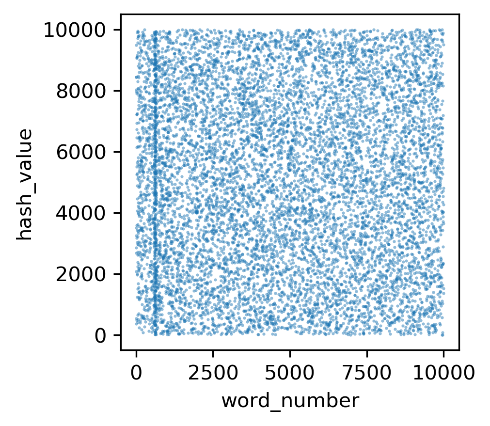
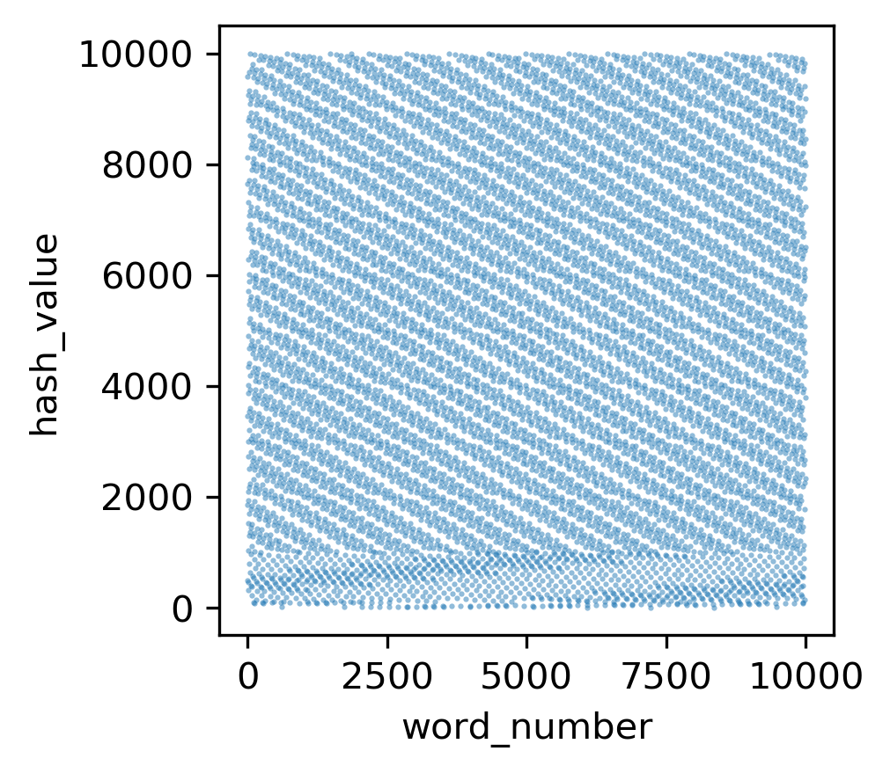
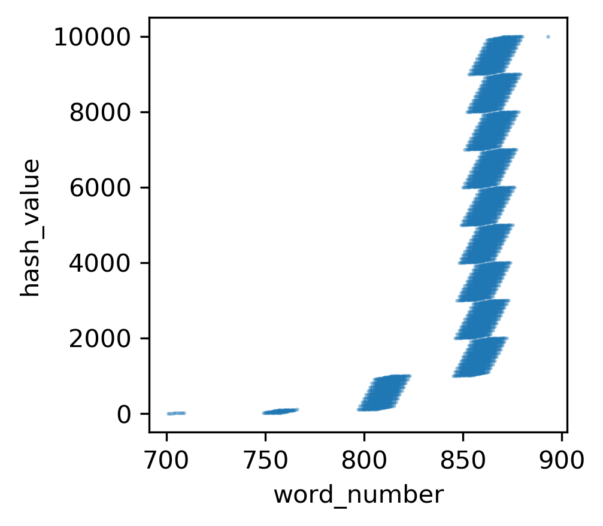
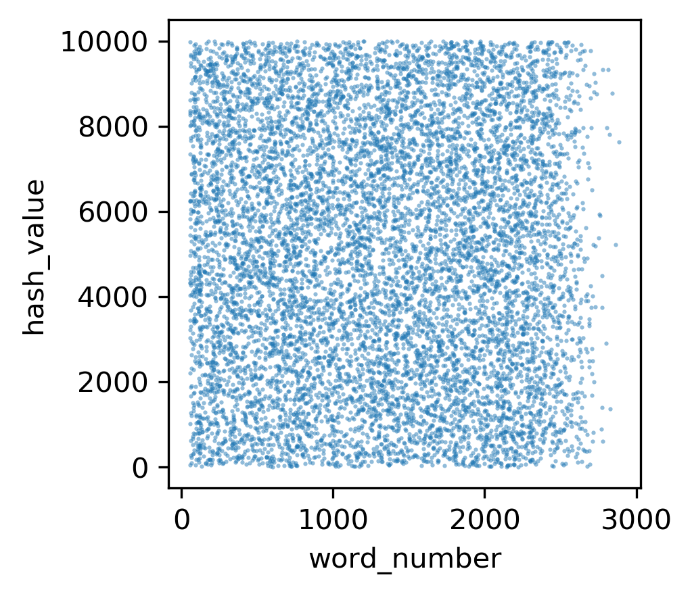
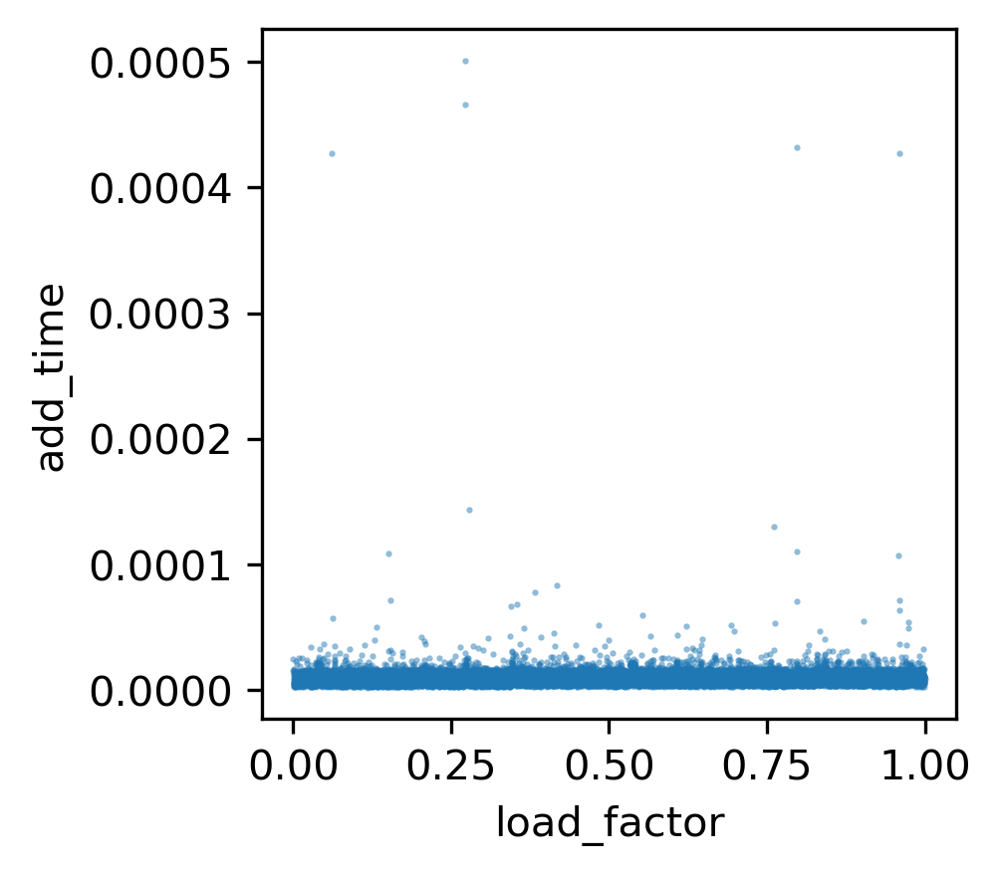
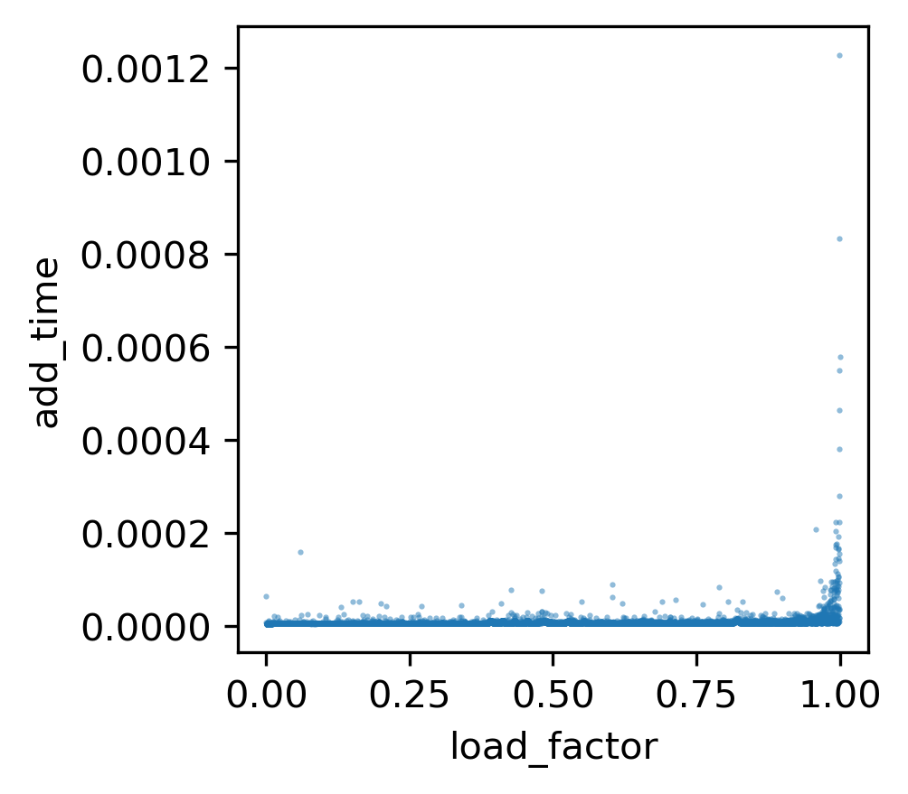
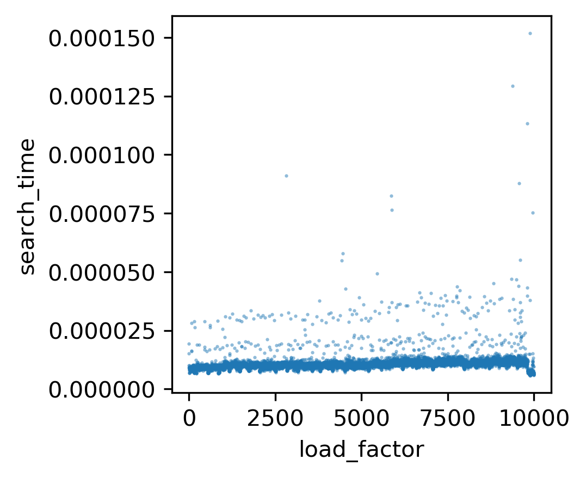
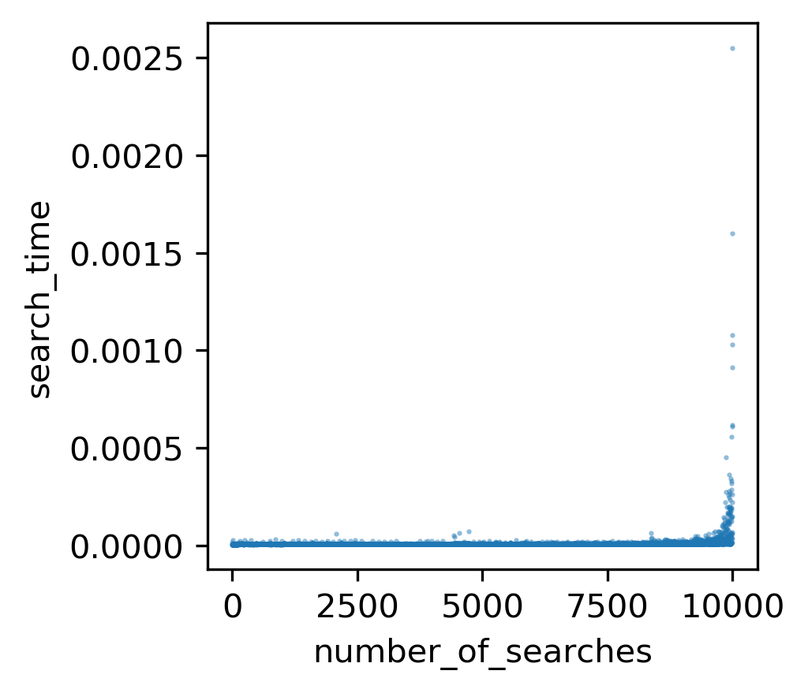

# Hash tables

## Installation

Install the following dependencies in a conda environment and activate the environment

```sh
wget https://repo.anaconda.com/miniconda/Miniconda3-latest-Linux-x86_64.sh
bash Miniconda3-latest-Linux-x86_64.sh -b
~/miniconda3/etc/profile.d/conda.sh
conda update --yes conda
conda config --add channels r
conda create --yes -n test
conda activate test
conda install -y pycodestyle
conda install --yes python=3.6
conda install matplotlib
```

## Usage
The libraries hash_functions and hash_tables can be imported in any script, in order to use the defined functions therein. 
```python
import hash_functions
import hash_tables
```
Alternatively, hash_tables can be run on its own, to produced a hashed array of values from a file
```sh
python hash_tables.py --probe_type (linear or chained) --hash_type(rolling or ascii) --table_size (integer) --key_file (/path/to/file) --number_of_keys (integer)
```
This will output a time profile for how long it took to perform the add and search operations. This information can be visualized using the scatter.py script, which reads from stdin produced from hash_tables.py

For profiled search times, use the following:
```sh
python hash_tables.py --probe_type (linear or chained) --hash_type (rolling or ascii) --table_size (integer) --key_file (/path/to/file) --number_of_keys (integer) | grep search | python scatter.py output_file x_label y_label
```
This will output a scatterplot showing the relationship of search times relative to load factor. For add times:

```sh
python hash_tables.py --probe_type (linear or chained) --hash_type (rollingor ascii) --table_size (integer) --key_file (/path/to/file) --number_of_keys (integer) | grep add_time | python scatter.py output_file x_label y_label
```
For the efficiency of the hashing strategy in avoiding collisions:
```sh
python hash_tables.py --probe_type (linear or chained) --hash_type (rollingoython scatter.py output_filr ascii) --table_size (integer) --key_file (/path/to/file) --number_of_keys(integer) | grep hash_and_slot | python scatter.py output_file x_label y_label
```

Random and nonrandom words can be generated using the following scripts (each generates 10000 words)
```sh
python random_wordcreator.py
bash nonrandom_wordcreator.sh
```

Finally, test scripts will be run automatically to ensure proper functionality of the libraries
```sh
python test_hash_functions.py
python test_hash_tables.py
bash test_hash_tables.sh
```

## Profiling of different strategies

These scripts were used to generate the following graphs. Rolling hash strategies tend to result in less collisions with nonrandom words, while fully random strings seem to result in similar collision levels with both rolling hash and ascii hash

```sh
python hash_tables.py \
        --probe_type linear \
        --hash_type rolling \
        --table_size 10000 \
        --key_file random_words.txt \
        --number_of_keys 10000 | \
        grep hash_and_slot | \
        python scatter.py collisions_rolling_random word_number hash_value
```


```sh
python hash_tables.py \
        --probe_type linear \
        --hash_type rolling \
        --table_size 10000 \
        --key_file nonrandom_words.txt \
        --number_of_keys 10000 | \
        grep hash_and_slot | \        
	python scatter.py collisions_rolling_nonrandom word_number hash_value
```


```sh
python hash_tables.py \
        --probe_type linear \
        --hash_type ascii \
        --table_size 10000 \
        --key_file nonrandom_words.txt \
        --number_of_keys 10000 | \
        grep hash_and_slot | \       
	python scatter.py collisions_ascii_nonrandom word_number hash_value
```


```sh
python hash_tables.py \
        --probe_type linear \
        --hash_type ascii \
        --table_size 10000 \
        --key_file random_words.txt \
        --number_of_keys 10000 | \
        grep hash_and_slot | \        
	python scatter.py collisions_ascii_random word_number hash_value
```
i

Add/search times were similarly profiled. Linear probing is largely inefficient compared to chain hashing, unless the table size is much larger than the number of keys:

```sh
python hash_tables.py \
        --probe_type chained \
        --hash_type rolling \
        --table_size 10000 \
        --key_file random_words.txt \
        --number_of_keys 10000 | \
        grep add_time | \        
	python scatter.py add_time_chained_hash_rolling_random load_factor add_time
```


```sh
python hash_tables.py \
        --probe_type linear \
        --hash_type rolling \
        --table_size 10000 \
        --key_file nonrandom_words.txt \
        --number_of_keys 10000 | \
        grep add_time | \        
	python scatter.py add_time_linear_hash_rolling_nonrandom load_factor a
dd_time
```


```sh
python hash_tables.py \
        --probe_type chained \
        --hash_type rolling \
        --table_size 10000 \
        --key_file nonrandom_words.txt \
        --number_of_keys 10000 | \        
	grep search | \        
	python scatter.py search_time_chained_hash_rolling_nonrandom load_factor search_time
```
     

```sh
python hash_tables.py \
        --probe_type linear \
        --hash_type rolling \
        --table_size 10000 \
        --key_file nonrandom_words.txt \
        --number_of_keys 10000 | \        
	grep search | \        
	python scatter.py search_time_linear_probe_rolling_nonrandom load_factor search_time
```


Additional profiling tests are available for viewing within the repository.

## Release History
*1.0\
	*CHANGE: Updated hash_tables.py and hash_functions.py to include linear probing, chain hashing functionality, as well as two hash strategies\
	*ADDED: scatter.py script to visualize time profiling of hashing and collision functions\
	*ADDED: Added functional and unit tests for the following scr
ipts\
	*ADDED: PNG files of profiling tests\
	*ADDED: Additional hash strategy from python's built-in library\
	*ADDED: hash_table_runner.sh to easily run the above scripts\
	*ADDED: Random and nonrandom word generators\

## To Contribute
1. Fork it (< https://github.com/cu-swe4s-fall-2019/hash-tables-sahu0957.git>)
2. Create your feature branch (`git checkout -b feature_branch`)
3. Commit your changes (`git commit -m 'add your notes'`)
4. Push to the branch (`git push origin feature_branch`)
5. Create a new Pull request	
